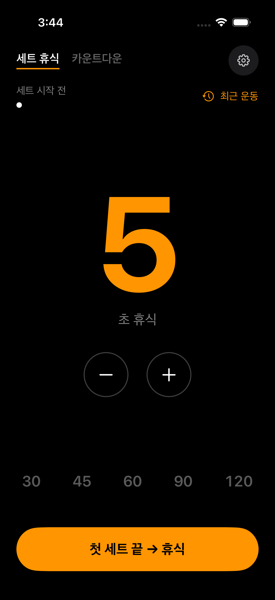
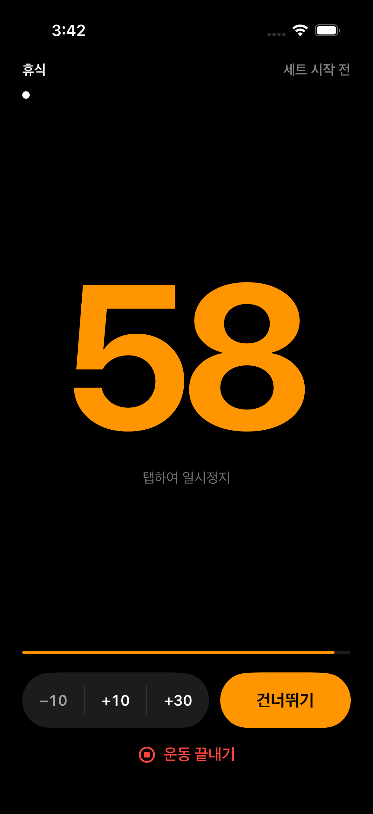
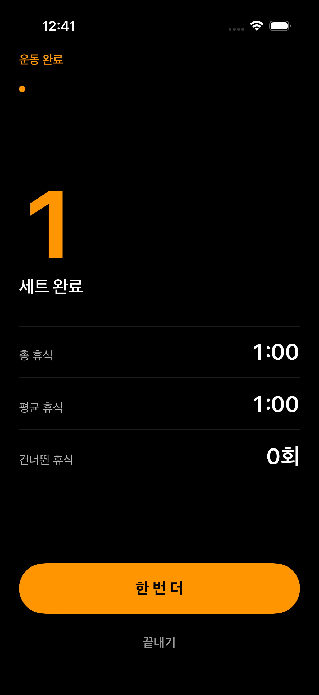
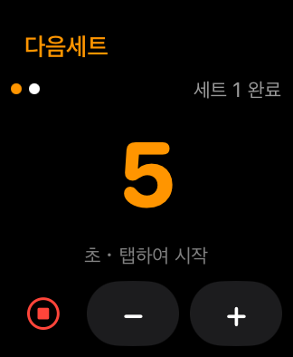

<p align="center"><a href="README.md">English</a> · <strong>한국어</strong></p>

<p align="center">
  
</p>

<h1 align="center">다음세트 · NextSet</h1>

<p align="center">
  <strong>운동에 집중하고, 휴식은 다음세트에 맡기세요.</strong><br>
  iPhone, iPad, Apple Watch를 위한 운동 휴식 타이머.<br>
  SwiftUI로 제작 · 한국어 / English 지원
</p>

<p align="center">
  <a href="#앱-미리보기">앱 미리보기</a> ·
  <a href="#빌드">빌드</a> ·
  <a href="https://unib35.github.io/NextSet/ko/support.html">지원</a> ·
  <a href="https://unib35.github.io/NextSet/ko/privacy.html">개인정보처리방침</a>
</p>

---

## 앱 미리보기

휴식 시간을 정하고, 운동의 흐름을 이어가고, 마친 운동을 확인하세요.

<table>
  <tr>
    <th width="33%">01 · 휴식 설정</th>
    <th width="33%">02 · 운동에 집중</th>
    <th width="33%">03 · 운동 마무리</th>
  </tr>
  <tr>
    <td></td>
    <td></td>
    <td></td>
  </tr>
</table>

<sub>예시 운동 데이터로 촬영한 한국어 시뮬레이터 화면입니다. 기기와 앱 버전에 따라 화면이 달라질 수 있습니다.</sub>

## 세트 사이의 휴식을 위해

| | 주요 기능 |
| :--- | :--- |
| **내 페이스에 맞게** | 세트 휴식·카운트다운 모드, 빠른 프리셋, 일시정지·재개, 휴식 시간 조절. |
| **한눈에 확인** | 홈·잠금화면 위젯, 실시간 현황, 제어 센터 컨트롤. |
| **손목에서도** | Apple Watch에서 휴식을 조절하고 로컬 알림으로 휴식 종료 확인. |
| **운동 기록 확인** | 기기에 저장된 최근 운동 요약 확인. |

<p align="center">
  <br>
  <sub>세트 사이, 손목에서 간편하게 확인하세요.</sub>
</p>

**회원가입 없이. 광고 없이. 인앱 구매 없이.** 운동 요약은 기기에 저장되며, 개발자 서버에 운동 기록을 보관하지 않습니다.

## 빌드

Xcode 26.5 이상에서 `NextSet/NextSet.xcodeproj`를 열고 **NextSet** 스킴을 선택하세요.
현재 최소 지원 버전은 iOS 26.5와 watchOS 26.5입니다.
iOS 스킴에 Watch 앱이 포함되므로 watchOS 시뮬레이터 런타임도 설치해야 합니다.
실기기 빌드 시 본인의 개발 팀을 선택하고 Bundle ID와 공유 App Group을 설정하세요.

```sh
xcodebuild test -project NextSet/NextSet.xcodeproj -scheme NextSet \
  -destination 'platform=iOS Simulator,name=iPhone 17' \
  -parallel-testing-enabled NO -only-testing:NextSetTests
```

## 지원 및 개인정보처리방침

- [한국어 지원](https://unib35.github.io/NextSet/ko/support.html)
- [한국어 개인정보처리방침](https://unib35.github.io/NextSet/ko/privacy.html)
- [English support](https://unib35.github.io/NextSet/en/support.html)
- [Privacy policy](https://unib35.github.io/NextSet/en/privacy.html)

## GitHub Pages

앱 소스와 공개 웹페이지 원본을 이 저장소에서 함께 관리합니다.
`tools/release-site/build.py`는 앱의 언어별 개인정보처리방침 리소스와 `docs/release/SUPPORT*.md`를 사용해 `docs/release/site`를 생성합니다.
Pages 워크플로는 생성된 디렉터리만 웹사이트로 배포합니다.

```sh
python3 tools/release-site/build.py
```

페이지 원본을 수정해 `main`에 푸시하면 자동으로 다시 배포됩니다. **Publish support pages** 워크플로를 수동 실행할 수도 있습니다.
