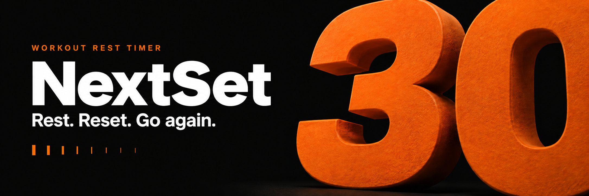
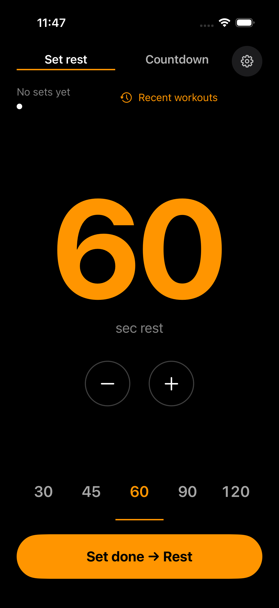
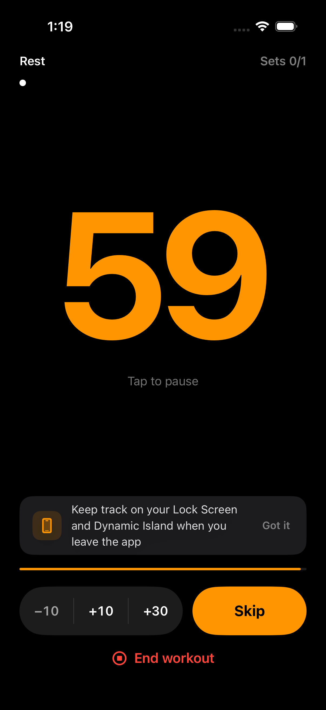
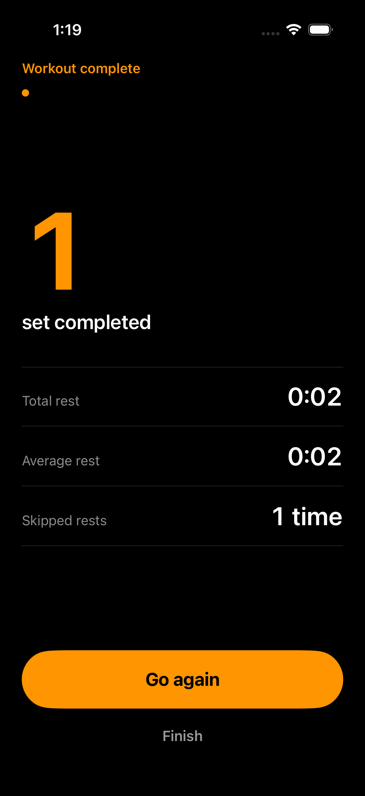
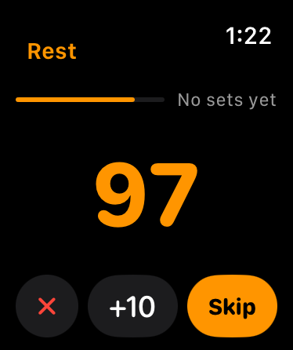

<p align="center"><strong>English</strong> · <a href="README.ko.md">한국어</a></p>

<p align="center">
  
</p>

<h1 align="center">NextSet · 다음세트</h1>

<p align="center">
  <strong>운동에 집중하고, 휴식은 다음세트에 맡기세요.</strong><br>
  A workout rest timer for iPhone, iPad, and Apple Watch.<br>
  Built with SwiftUI · 한국어 / English
</p>

<p align="center">
  <a href="#a-look-inside">Screenshots</a> ·
  <a href="#build">Build</a> ·
  <a href="https://unib35.github.io/NextSet/ko/support.html">지원</a> ·
  <a href="https://unib35.github.io/NextSet/en/support.html">Support</a> ·
  <a href="https://unib35.github.io/NextSet/en/privacy.html">Privacy</a>
</p>

---

## A look inside

Choose your rest. Keep your rhythm. See what you finished.

<table>
  <tr>
    <th width="33%">01 · Set your rest</th>
    <th width="33%">02 · Stay focused</th>
    <th width="33%">03 · Wrap it up</th>
  </tr>
  <tr>
    <td></td>
    <td></td>
    <td></td>
  </tr>
</table>

<sub>Actual simulator captures with sample workout data. Screens may vary by device and app version.</sub>

## Made for the time between sets

| | What you can do |
| :--- | :--- |
| **Your pace** | Set-rest and countdown modes, quick presets, pause/resume, and rest adjustment. |
| **A glance away** | Home and Lock Screen widgets, Live Activities, and Control Center controls. |
| **On your wrist** | Apple Watch companion with rest controls and local rest-end notifications. |
| **Your workout history** | Review recent workout summaries stored on your device. |

<p align="center">
  <br>
  <sub>A quick check between sets, right on your wrist.</sub>
</p>

**No account. No ads. No in-app purchases.** Workout summaries stay on your device, with no developer-hosted workout storage.

## Build

Open `NextSet/NextSet.xcodeproj` in Xcode 26.5 or later and select the **NextSet** scheme.
The current minimum OS versions are iOS 26.5 and watchOS 26.5.
Install the watchOS simulator runtime because the iOS scheme embeds the Watch app.
For a device build, select your own development team and configure your bundle IDs and shared App Group.

```sh
xcodebuild test -project NextSet/NextSet.xcodeproj -scheme NextSet \
  -destination 'platform=iOS Simulator,name=iPhone 17' \
  -parallel-testing-enabled NO -only-testing:NextSetTests
```

## Support and privacy

- [한국어 지원](https://unib35.github.io/NextSet/ko/support.html)
- [한국어 개인정보처리방침](https://unib35.github.io/NextSet/ko/privacy.html)
- [English support](https://unib35.github.io/NextSet/en/support.html)
- [Privacy policy](https://unib35.github.io/NextSet/en/privacy.html)

## GitHub Pages

The app source and public page sources live in this repository.
`tools/release-site/build.py` generates `docs/release/site` using the app's localized privacy resources and `docs/release/SUPPORT*.md`.
The Pages workflow publishes only that generated directory, never the app source tree.

```sh
python3 tools/release-site/build.py
```

Push changes to the page sources on `main` to redeploy, or run the **Publish support pages** workflow manually.
